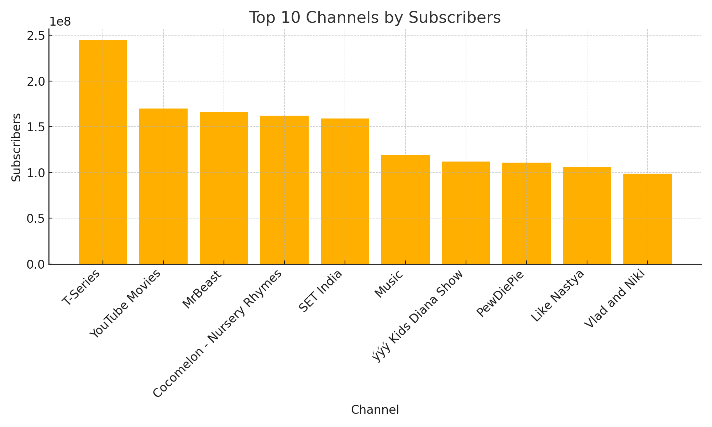

# 📺 YouTube Global Statistics Analysis

This project analyzes a dataset of global YouTube channel metrics, exploring subscriber counts, video views, uploads, categories, and estimated earnings across the world.

---

## 📊 Key Visualizations

1. **Top 10 Channels by Subscribers**  
2. **10 Least-Subscribed Channels**  
3. **Top 10 Channels by Video Views**  
4. **Channels per Category**  
5. **Uploads vs Subscribers** (Top 10 Uploaders)  
6. **Channels by Country** (Top 20)  
7. **Channels Created per Year (2005+)**  
8. **Interactive Earnings Map** (Top 20)

---

## 🛠️ Technologies & Libraries

- **Python 3.11+**  
- **pandas** for data loading and manipulation  
- **Matplotlib** for static visualizations  
- **Folium** for interactive maps  
- **Modular project structure**:
  - `Dataset.py` — dataset path enumeration  
  - `Util.py` — data loading and initial cleaning  
  - `graph.py` — reusable chart functions  
  - `analysis.py` — plotting routines for each task  
  - `solution.ipynb` — Jupyter Notebook demonstrating all analyses

---

## 🚀 Getting Started

1. **Clone the repository**  
   ```bash
   git clone https://github.com/your-username/youtube-global-stats.git
   cd youtube-global-stats
   ```

2. **Install dependencies**  
   ```bash
   pip install pandas matplotlib folium
   ```

3. **Run the notebook**  
   ```bash
   jupyter notebook solution.ipynb
   ```

4. **Or use Python scripts**  
   ```python
   from Dataset import Dataset
   from Util import read_youtube_data
   import analysis as a

   df = read_youtube_data(Dataset.YOUTUBE)

   a.plot_top_subscribers(df)
   a.plot_bottom_subscribers(df)
   a.plot_top_views(df)
   a.plot_channels_by_category(df)
   a.plot_uploads_vs_subscribers(df)
   a.plot_channels_by_country(df)
   a.plot_channels_by_year(df)

   m = a.plot_earnings_map(df)
   m.save("earnings_map.html")
   ```

---

## 📁 Repository Structure

```
youtube-global-stats/
├── datasets/
│   └── global_youtube_statistics.csv
├── Dataset.py
├── Util.py
├── graph.py
├── analysis.py
├── solution.ipynb
└── readme.rd
```

---

## 📈 Sample Output

  


---

## ✨ Author

**Leticia Paulino**  
[LinkedIn](https://www.linkedin.com/in/paulino-leticia/) · [GitHub](https://github.com/letpaulino)

> ⭐ If you enjoyed this project, please consider leaving a star!